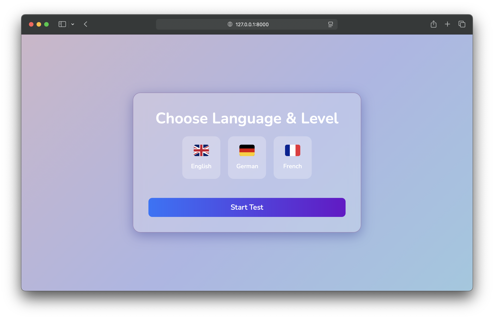

# ABLE (AI-Based Language Evaluation)

**ABLE** (AI-Based Language Evaluation), kullanıcıların Almanca, İngilizce ve Fransızca dillerinde A1'den C2'ye kadar seviyeler seçerek test çözebileceği bir dil değerlendirme platformudur. Gemini AI desteğiyle, kişiselleştirilmiş dil testleri oluşturur ve kullanıcının seviyesine göre dinamik testler sunar.

## 🚀 Özellikler

- Almanca 🇩🇪, İngilizce 🇬🇧 ve Fransızca 🇫🇷 dillerinde testler
- A1'den C2'ye kadar seviye seçimi
- Gemini destekli dinamik test oluşturma
- Test çözme ve skor görüntüleme
- Kişiselleştirilmiş test önerisi

## 📦 Kurulum

1. Projeyi klonlayın:
   ```bash
   git clone https://github.com/Grup54/AI-Based-Language-Evaluation.git
   cd AI-Based-Language-Evaluation
2.Projeyi çalıştırın:
```bash
# Windows kullanıcıları için:
run.bat

# macOS / Linux kullanıcıları için:
./run.sh

## 🖼️ Örnek Arayüz



